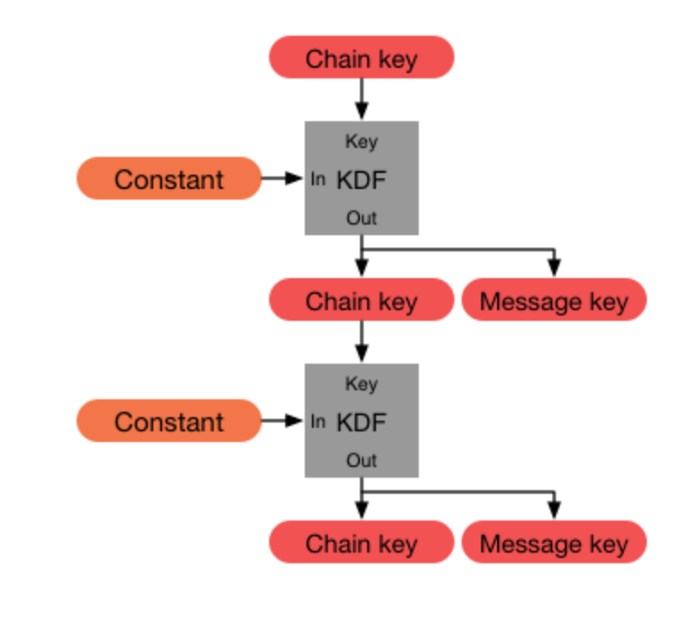
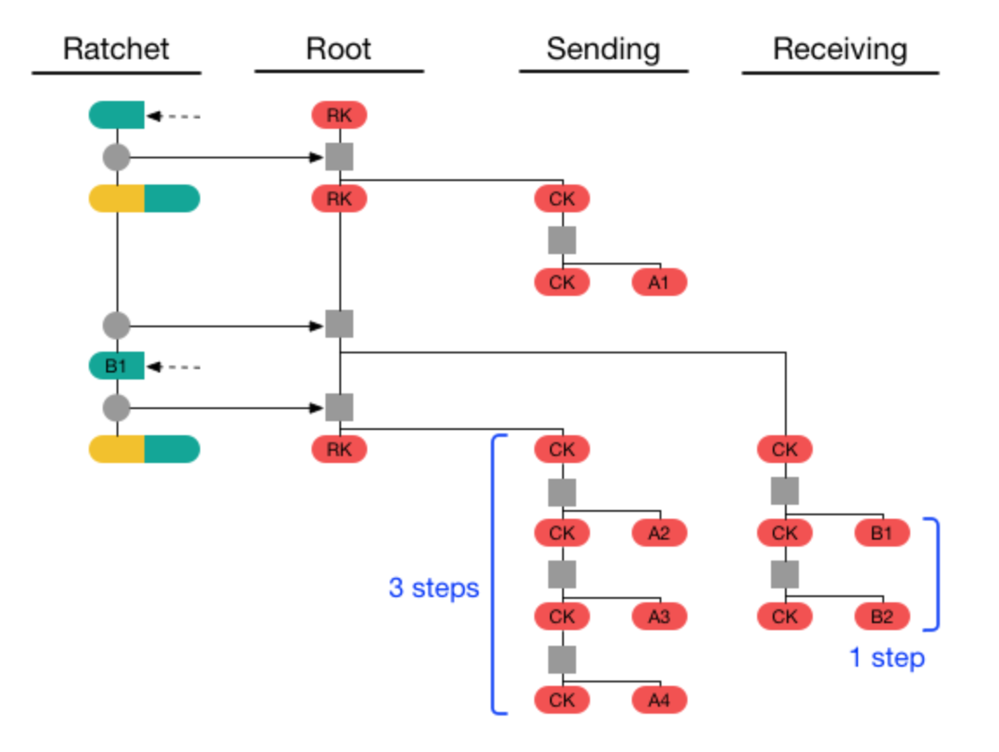

# Libsignal code tour

# libsignal.ecc

libsignal choose X25519 curve and these package its corresponding ECPublicKey, ECPrivateKey, and ECKeyPair. It first defines the `ECPublicKey` and `ECPrivateKey` interfaces, and then define 2 `DjbECPrivateKey` and `DjbECPublicKey` classes to implement the interfaces. `{libsignal.util.KeyHelper}` can generate different keys based on this.

# libsignal.KDF

In this package, `HKDF` abstract class provides the HKDF, which is a simple key derivation function based on HMAC message authentication code and also there are `HKDFv2` and `HKDFv3` that have different Iteration Start Offsets. Basically, HKDF has 2 steps:

1. Extract: PRK = HMAC-Hash(salt, IKM)
2. Expand: OKM = HKDF-Expand(PRK, info, L)

these 2 steps are realized in the `HKDF` abstract class with corresponding methods. 

HKDF is used in Symmetric-key ratchet in Signal Double Ratchet protocol, which is implemented in {libsignal.ratchet} package. 

In Symmetric-key ratchet, we take SharedSecret of the two parties as input Key Material, and take the Key as salt(optional). This returns a Key material output, which is a byte array. We can decode this array into a `DerivedRootSecrets` or `DerivedMessageSecrets`. For example

```java
byte[]             sharedSecret       = Curve.calculateAgreement(theirRatchetKey, ourRatchetKey.getPrivateKey());
byte[]             derivedSecretBytes = kdf.deriveSecrets(sharedSecret, key, "WhisperRatchet".getBytes(), DerivedRootSecrets.SIZE);
DerivedRootSecrets derivedSecrets     = new DerivedRootSecrets(derivedSecretBytes);
RootKey  newRootKey  = new RootKey(kdf, derivedSecrets.getRootKey());
ChainKey newChainKey = new ChainKey(kdf, derivedSecrets.getChainKey(), 0);
```

```java
byte[]                inputKeyMaterial = getBaseMaterial(MESSAGE_KEY_SEED);
byte[]                keyMaterialBytes = kdf.deriveSecrets(inputKeyMaterial, "WhisperMessageKeys".getBytes(), DerivedMessageSecrets.SIZE);
DerivedMessageSecrets keyMaterial      = new DerivedMessageSecrets(keyMaterialBytes);
MessageKey            messageKey       = new MessageKeys(keyMaterial.getCipherKey(), keyMaterial.getMacKey(), keyMaterial.getIv(), index);
```

# libsignal.ratchet

This package provides the different classes of Signal Double Ratchet protocol.

### Key

There are 3 key class. `ChainKey` and `MessageKeys` maintain the symmetric-key ratchet as follows:



and The `RootKey` maintains a rootChain which can derive the `ChainKey` as follows:



### Parameters

There are also 3 classes that have the parameters setting according to the Identity.

- `SymmetricSignalProtocolParameters` Builds the structure of one identity in Symmetric-key ratchet.
- `AliceSignalProtocolParameters` The parameters setting and building as Alice in Signal Protocol. (sender)
    
    that is, contacts the server and fetches a prekey bundle and send the initial message. Also, send a RatchetKey to Bob to calculate DH and create a new KDF chain in case the previous Chain key breaks.
    
- `BobSignalProtocolParameters` The parameters setting and building as Bob in Signal Protocol (receiver)
    
    that is, publishing a set of elliptic curve public keys to the server and retrieves Alice's identity key and ephemeral key from the message. Also, has a RatchetKey and may receive a ratchet key to create a new KDF chain in case the Chain key breaks.
    

### RatchetingSession

setting up and can initialize the ratcheting session.

# libsignal.protocol

This package provides an interface of a `CiphertextMessage` and defines 5  Signal protocol cipher messages which implement the interface.

### SignalMessage

This class define a signal ciphertext message class between two parties. the message can be encrypted into a Signal message and be decrypted in `SessionCipher`.

### PreKeySignalMessage

this message is transmitted between Alice and Bob, it contains the `SignalMessage` and collection of associated key items. Once the session is constructed, the `SignalMessage` can be decrypted.

### SenderKeyMessage

The message encrypted by `SenderMessageKey` in the group messaging.

### SenderKeyDistributionMessage

This message will be distributed to each member of the group

# libsignal.groups(Group messages)

## Theory

### **The first time a  group member sends a message to a group**

1. The sender generates a random 32-byte `Chain Key`
2. The sender generate a random Curve25519 `Signature Key` key pair.
3. The sender combines the 32-byte `Chain Key` and the `public key`from the `Signature Key` into a `SenderKeyMessage`
    
    Combining means it just combines chain key and Signature public key to create Sender key but later receivers can decompose this Sender key into chain key and Signature public key.
    
4. Then the sender key will be encrypted and distributed to all the group participants. 

In libsignal, it defines this `SenderKeyMessage` in `{@link org.whipsersystems.libsignal.protocol.SenderKeyMessage}.`and `{org.whipsersystems.libsignal.protocol.SenderKeyDistributionMessage}`.

### **If a sender wants to send a group message.**

1. The sender derives a `Message Key` from the `Chain Key`as:
    
    HMAC-SHA256 = (Chain key, 0x01)
    
     and updates the `Chain Key`as
    
    HMAC-SHA256 = (Chain key, 0x02)
    
2. The sender encrypts the message using `AES256` in `CBC mode`.
3. The sender signs the `ciphertext` using the `Signature Key`.
4. The sender transmits the single ciphertext message to the server. The server creates copies of the cipher text and sends it to every member, which does **server-side fan-out** to all group participants.

The `“hash ratchet”` of the message sender’s `Chain Key` provides **forward secrecy**. Whenever a group member leaves, the session is shut down and starts over again in the Setup Phase. Group participants clear their `Sender Key` and **start over**. This is done because former member has learned everybody's `Sender keys` so they clear their old sender key and exchange new sender key with each other.

## libsignal.group

It is responsible for group messaging. `GroupSessionBuilder` is used for setting up group SenderKey(presented in {Libsignal.group.state} repository) sessions which are constructed per (groupId + senderId + deviceId) tuple (presented in `SenderKeyName)`.  After building the session, `GroupCipher` can be used to encrypt/decrypted the message by `SenderKeyMessageKey` derived from `SenderChainKey`(presented in {Libsignal.group.ratchet}). 

### SenderKeyName

**Its a representation of a (groupId + senderId + deviceId) tuple**

### GroupSessionBuilder

**For setting up group SenderKey encrypted sessions.**

- Once a session has been established, GroupCipher can be used to encrypt/decrypt messages in that session.
- The built sessions are unidirectional, they can be used either for sending or for receiving, but not both.
- Sessions are constructed per (groupId + senderId + deviceId) tuple. Remote logical users are identified by their senderId, and each logical recipientId can have multiple physical devices.

### GroupCipher

**The main entry point for Signal Protocol group encrypt/decrypt operations.** 

Once a session has been established with GroupSessionBuilder and a SenderKeyDistributionMessage has been distributed to each member of the group, this class can be used for all subsequent encrypt/decrypt operations within that session (ie: until group membership changes).

## Libsignal.group.ratchet

provides the `SenderChainKey` and `SenderMessageKey` classes.  `SenderChainKey` can derive the `SenderMessageKey` and update its new `SenderChainKey` as follows:

```java
SenderChainKey chainKey = new SenderChainKey();
SenderMessageKey messageKey = chainKey.getSenderMessageKey();
SenderChainKey updatedChainKey = chainKey.getNext();
```

## Libsignal.group.state

- `SenderKeyState` is the state of an individual SenderKey ratchet.
- `SenderKeyRecord` is a durable representation of a set of SenderKeyStates for a specific SenderKeyName.
- `SenderKeyStore` is an interface committed to storage the `SenderRecord` for a given {groupId + senderId + deviceId} tuple. It will manage loading and storing of SenderKey state.

# libsignal.state

An established **session** encapsulates a lot of **state** between two clients. That **state** is maintained in durable **records** which need to be kept for the life of the session. Therefore, this package has the  `record` methods to maintain the corresponding state.

## Record

### PreKeyRecord

A `PreKeyRecord` encapsulate the PreKey which is an ECPublicKey and an associated unique ID which stored together by a server can be signed.

At install time, clients generate a single signed PreKey, and a large list of unsigned PreKeys and transmit all of them to the server. This class offer getter methods of its ID and keyPair and can also encode its structure to bytearray.

### SignedPreKeyRecord

a signed public key to verify that the signer is in control of his private key.

### SessionRecord

A SessionRecord encapsulates the state of an ongoing session.

---

## PreKeyBundle

In X3DH protocol, the prekey bundle is used to initial the first message between Alice and Bob.  Bob will first publishes his identity key and prekeys (which is a preKey bundle) to a server. Then, Alice fetches a prekey bundle from the server and uses it to send an initial message to Bob. Finally, Bob receives and processes Alice's initial message.  a prekey bundle includes:

- Bob's identity key $IK_B$
- Bob signed prekey $SPK_B$
- Bob's prekey signature $Sig(IK_B, Encode(SPK_B))$
- (Optionally) Bob's one-time prekey $OPK_B$

Therefore, this `PreKeyBundle` class is defined to contain a remote PreKey and collection of associated items. Generally in X3DH protocol, Bob should publish this. Bundle to the server and Alice can fetch this preKey bundle. Also, this class has the information of the prekey, e.g. deviceId, PreKeyId, registrationId etc.

---

## Store

A libsignal client needs to implement four interfaces: `IdentityKeyStore`, `PreKeyStore`, `SignedPreKeyStore`, and `SessionStore`. These will manage loading and storing of identity, prekeys, signed prekeys, and session state.

### SessionStore

The interface to the durable store of session state information for remote clients. This interface can manage loading, storing, deleting, containing sessions and getting subdevice sessions. 

- **loadSession**
    
    It is important that implementations return a copy of the current durable information. The returned SessionRecord may be modified, but those changes should not have an effect on the durable session state (what is returned by subsequent calls to this method) without the store method being called here first.
    
- **storeSession**
    
    Commit to storage the SessionRecord for a given recipientId + deviceId tuple.
    
- **containsSession**
    
    Determine whether there is a committed SessionRecord for a recipientId + deviceId tuple.
    
- **delete(All)Session(s)**
    
    Remove a SessionRecord for a recipientId + deviceId tuple. (or remove SessionRecords to all corresponding recipientId + deviceId tuple).
    
- **getSubDevicesSessions**
    
    Returns all known devices with active sessions for a recipient
    

---

### PreKeyStore

An interface describing the local storage of PreKeyRecords.

### SignedPreKeyStore

an interface that describes the local storage of SignedPreKeyRecord

### IdentityKeyStore

Provides an interface to identity information (e.g IdentityKey pair, local registration Id...etc).

---

## SessionState

This `SessionState` class defines a session state that can set or get its various attributes. 

# libsignal

## Identity Key and Key Pair

This provides two classes `IdentityKey` and `IdentityKeyPair` to IdentityKey and Identity Key pair.

Therefore at install time, a libsignal client can generate its identity keys, registration Id and preKey as follows:

```java
IdentityKeyPair    identityKeyPair = KeyHelper.generateIdentityKeyPair();
int                registrationId  = KeyHelper.generateRegistrationId();
List<PreKeyRecord> preKeys         = KeyHelper.generatePreKeys(startId, 100);
SignedPreKeyRecord signedPreKey    = KeyHelper.generateSignedPreKey(identityKeyPair, 5);

// Store identityKeyPair somewhere durable and safe.
// Store registrationId somewhere durable and safe.

// Store preKeys in PreKeyStore.
// Store signed prekey in SignedPreKeyStore.
```

## SignalProtocolAddress

In Signal Protocol, this address provides the name of the user and its corresponding deviceID.

## Session Builder and Cipher

After implementing the store interfaces,  we can build a session and encrypt/decrypt the message using this `SessionBuilder` and `SessionCipher` classes as follows:

```java
SessionStore      sessionStore      = new MySessionStore();
PreKeyStore       preKeyStore       = new MyPreKeyStore();
SignedPreKeyStore signedPreKeyStore = new MySignedPreKeyStore();
IdentityKeyStore  identityStore     = new MyIdentityKeyStore();

// Instantiate a SessionBuilder for a remote recipientId + deviceId tuple.
SessionBuilder sessionBuilder = new SessionBuilder(sessionStore, preKeyStore, signedPreKeyStore,
                                                   identityStore, recipientId, deviceId);

// Build a session with a PreKey retrieved from the server.
sessionBuilder.process(retrievedPreKey);

SessionCipher     sessionCipher = new SessionCipher(sessionStore, recipientId, deviceId);
CiphertextMessage message      = sessionCipher.encrypt("Hello world!".getBytes("UTF-8"));

deliver(message.serialize());
```

### SessionBuilder

SessionBuilder is responsible for setting up encrypted sessions. Once a session has been established, `SessionCipher` can be used to encrypt/decrypt messages in that session. Sessions are built from one of three different possible vectors

1. A `PreKeyBundle` retrieved from a server. (2nd phase of X3DH key agreement, build the initial session)
2. A `PreKeySignalMessage` received from a client.(transmitting messages between Alice and Bob). After a session is constructed, the `SignalMessage` embedded in `PreKeySignalMessage` can be decrypted.

Sessions are constructed per recipientId + deviceId tuple. Remote logical users are identified by their recipientId, and each logical recipientId can have multiple physical devices.

### SessionCipher

The main entry point for Signal Protocol encrypt/decrypt operations. Once a session has been established with SessionBuilder, this class can be used for all encrypt/decrypt operations within that session.

## DecryptionCallback

This interface is implemented in `SessionCipher` to provide a `NullDecryptionCallback` method. A callback is triggered after decryption is complete, but before the updated session state has been committed to the session DB. This allows some implementations to store the committed plaintext to a DB first, in case they are concerned with a crash happening between the time when the session state is updated but before they're able to store the plaintext to disk.

## Exception

[Exception](https://www.notion.so/ac45d1da53744e23b79c79ca73c4a5d1)

# libsiganl.util

This package offers some util classes.

- **KeyHelper**
    
    Helper class for generating keys of different types.
    
- **ByteUtil**
    
    a util class for Byte
    
- **Hex**
    
    Utility for generating hex dumps.
    
- **IdentityKeyComparator**
    
    a comparator to compare two PublicKeys.
    
- **Pair**
    
    a class to pair two objects.
    

# Reference

Signal Protocol Docs: [https://signal.org/docs/](https://signal.org/docs/)

Libsignal-protocol-java: [https://github.com/signalapp/libsignal-protocol-java](https://github.com/signalapp/libsignal-protocol-java)

Groups:  

[https://crypto.stackexchange.com/questions/62619/signal-sender-keys-why-it-works-and-which-is-the-common-key-at-the-end](https://crypto.stackexchange.com/questions/62619/signal-sender-keys-why-it-works-and-which-is-the-common-key-at-the-end)

[https://www.reddit.com/r/signal/comments/a2ogk2/this_is_how_signal_protocol_encrypts_group/](https://www.reddit.com/r/signal/comments/a2ogk2/this_is_how_signal_protocol_encrypts_group/)

[https://www.youtube.com/watch?v=Q0_lcKrUdWg](https://www.youtube.com/watch?v=Q0_lcKrUdWg)